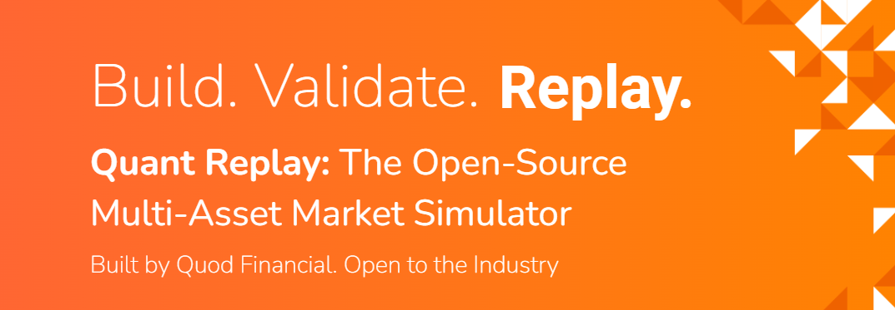
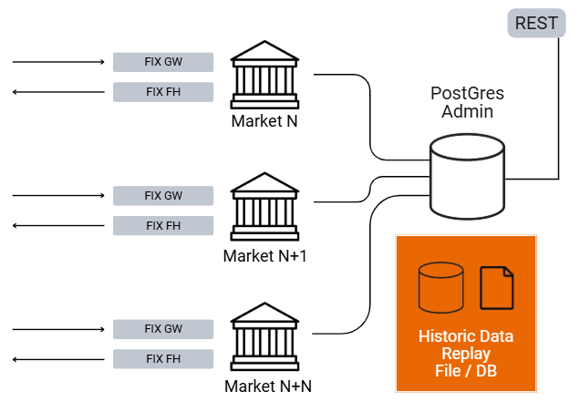

<div align="center">
  <a href="https://www.quodfinancial.com/">
    
  </a>
  <br>
  <br>
  <strong>Open Source Multi-Asset Market Simulator</strong>
  <br>
  <br>
</div>

A realistic market simulator for testing and building better trading strategies.

<div align="center">
  <a href="https://www.quodfinancial.com/">
    
  </a>
  <br>
</div>

QuantReplay is an open-source market simulator suite that you can host yourself, creating order-driven venues, with a matching engine, and publishing of market data, to test your trading and execution applications and strategies.

* **Simulator**. QuantReplay replays stored market data, but also can generate randomized orders, which are published via a FIX feed. The orders from your application connect via a FIX gateway to the matching engine, which can be in both continuous and auction mode, for single and multi-listed instruments. It covers all asset classes which are Order-driven, e.g. Equities, FX, Derivatives, exchange-listed fixed income.
* **Choice of your data**. QuantReplay provides multiple mechanisms to create the data published back to your applications \- Replay from a file and Auto-generated by QuantReplay.
* **Low footprint**. QuantReplay runs as a single native process per simulated venue, with a shared database across each venue instance.
* **Easy deployment**. Runs in a dockerized container, easy to deploy to any environment.

<div align="center">
  <a href="https://www.quodfinancial.com/">
    
  </a>
  <br>
</div>

## Features

* **Multiple Markets and Listings.** Configure separate concurrent markets and traded listings, using industry standard symbology, and custom trading rules to emulate distinct markets.
* **Matching Engine.** Standard price/time priority order book matching logic, with support for different order types and time in force. Subscribe to L2 market depth full refresh or incremental updates, specified depth levels, and L1 details such as Last Trades, OHLC, and more.
* **Market Phases.** Continuous trading and configurable market phases.
* **Random Order Generation.** Realistic pseudo random order activity at a configurable update rate and quantity and price range.
* **Historic Data Playback.** Playback of historic multi level market data from a database or CSV file.
* **Recovery Options.** Save and recover system state on demand.
* **API.** FIX API for trading functions and REST API for remote administration of settings and status.

These features can be used in different trading and execution scenarios.

## Example Use Cases

<table>
  <tbody>
    <tr>
      <th>Strategy Backtesting for Quant Developers</th>
      <th>Market Microstructure and Latency Testing</th>
      <th>Training AI/ML Models for Smart Order Routing (SOR)</th>
    </tr>
    <tr>
      <td>You want to evaluate a new mean-reversion strategy before deploying it to a live trading system.</td>
      <td>You want to test how changes in market connectivity or order routing affect latency-sensitive strategies.</td>
      <td>You want to train and evaluate a reinforcement learning model that makes real-time order placement decisions across multiple venues.</td>
    </tr>
    <tr>
      <td><b>How it works:</b>
         <ul>
             <li>You write a trading algorithm using the simulator’s API.</li>
             <li>Historical market data (e.g., equities or FX tick data) is fed into the simulator.</li>
             <li>The simulator executes trades based on the strategy’s logic, accounting for slippage, latency, and execution
                 rules.
             </li>
             <li>Performance metrics like PnL, Sharpe ratio, max drawdown, and trade volume are generated in real time.</li>
         </ul>
      </td>
      <td><b>How it works:</b>
         <ul>
             <li>The simulator recreates a high-frequency trading environment with configurable latency profiles, order book depth, and market microstructure.</li>
             <li>You simulate various network and co-location scenarios.</li>
             <li>Synthetic or real-time data is replayed to test the system’s responsiveness.</li>
             <li>The simulator provides logs and metrics for event timestamps, order acknowledgment latency, and execution time.</li>
         </ul>
      </td>
      <td><b>How it works:</b>
         <ul>
             <li>The simulator provides a multi-venue market with dynamic spreads, liquidity, and volatility.</li>
             <li>The RL agent interacts with the simulated market to place orders based on state features (e.g., LOB depth, time, last fill).</li>
             <li>Rewards are calculated based on execution quality (e.g., price improvement, slippage, and fill ratio).</li>
             <li>Multiple training episodes can be run using parallel simulations.</li>
         </ul>
      </td>
    </tr>
    <tr>
      <td><b>Benefit:</b><br>
         Enables robust validation of trading strategies without the cost and risk of real-world execution.
      </td>
      <td><b>Benefit:</b><br>
         Offers a safe and reproducible environment to optimize infrastructure for low-latency trading.
      </td>
      <td><b>Benefit:</b><br>
         Enables AI model development for complex market environments without requiring proprietary exchange access or production-grade setups.
      </td>
    </tr>
  </tbody>
</table>


## Roadmap

* **Additional Market Phases.** Support for Auction and Trade at Last market phases.
* **Multi-listed Instruments.** Synchronization of prices for random order generation across multiple listings of the same instrument.
* **Real-Time Data Playback.** In addition to playback of historic data recorded in a database or file, also the ability to take a real-time FIX feed of market data, and play it back through the simulator in a way it can be traded against.
* **High Availability Recovery.** Additional recovery option to run multiple simulator instances and seamlessly recover from application failures during long test runs.
* **Client Simulation Mode.** Simulator acting as a client, generating random orders to populate activity in a third party trading system able to receive orders through FIX.
* **Extreme Market Events.** Scheduling extreme events such as high volatility, large price swings, and increased market impact as part of random order generation.
* **Quote-Driven Market.** Publishing a stream of quotes to simulate asset classes supporting bilateral quote streams, such as Foreign Exchange price streaming and Request For Quote (RFQ) workflows, Fixed income RFQ, etc.
* **AI Driven Market Simulation**. Order generation via a Generative Adversarial Network (deep learning) to replace statistical or stochastic point processes approach. This allows them to mimic any markets in real time.
* **QuantReplay Cloud**: Deploy and use QuantReplay in the Quod Financial provided cloud.

## Deployment Options

### Quickstart

The simplest way to get started with QuantReplay is to run it in a [Docker Compose](https://docs.docker.com/compose/install/):
1. Create a directory.
2. Create a `docker-compose.yml` file in that directory.
3. Copy the following example in the `docker-compose.yml` file:

```yml
networks:
   market-simulator-net:
      driver: bridge

services:
   XETRA:
      image: ghcr.io/quod-financial/deploy_marketsim:develop
      container_name: XETRA
      networks:
         - market-simulator-net
      ports:
         - "9050:9050" # Port to sent REST API requests
         - "9051:9051" # Port to sent FIX messages
      volumes:
         - ./:/market-simulator/quod/data/
      environment:
         - INSTANCE_ID=SIMULATOR
         - PREFIX=QUOD
      depends_on:
         liquibase:
            condition: service_completed_successfully

   database:
      image: ghcr.io/quod-financial/postgres_marketsim:v13.4-init
      container_name: market-simulator-database
      networks:
         - market-simulator-net
      ports:
         - 15432:5432
      environment:
         - POSTGRES_DB=simdb
         - POSTGRES_USER=postgres
         - POSTGRES_PASSWORD=postgres
      healthcheck:
         test: [ "CMD-SHELL", "pg_isready --user=postgres --dbname=simdb" ]
         retries: 2
         interval: 5s
         timeout: 10s

   liquibase:
      image: ghcr.io/quod-financial/liquibase:develop
      container_name: market-simulator-liquibase
      networks:
         - market-simulator-net
      depends_on:
         database:
            condition: service_healthy
```

4. Run the docker compose command to start the simulator:
```bash
docker compose up -d
```
5. It will create a `cfg` directory with the following structure:
   - `market_simulator.xml` - main configuration file for QuantReplay;
   - `configSim.txt` - QuickFIX configuration file [QuickFIX documentation](https://quickfixengine.org/c/documentation/);
   - `default` - the directory with QuickFIX AppDataDictionary and TransportDataDictionary files of FIX 5.0 SP2 version.
6. The database already contains the demo data, which can be used to test the simulator:
   - XETRA venue;
   - instruments:
     - AMZ;
     - MSF;
     - NFC;
     - VODI;
     - VOW.
7. Now you can send [REST API requests](#rest-api-requests-examples) and [FIX messages](#fix-requests-and-quantreplay-replies-examples) to QuantReplay using:
   - localhost:9050 for REST API requests;
   - localhost:9051 for FIX messages.

## FIX requests and QuantReplay replies examples

The complete list of supported FIX messages, tags, and message flows can be found in [FIX Rules of Engagement](https://quod-financial.github.io/quantreplay/FIXRulesOfEngagement/FIXRulesOfEngagement.html).

### Order session

#### Order placement

request NewOrderSingle:
```
8=FIXT.1.1|9=126|35=D|49=CLIENT_XETRA|56=SIM_XETRA|34=2|52=20250624-14:02:53|11=1|21=1|55=VOW|54=1|60=20250624-14:02:53|40=2|44=10|38=100|59=0|10=037|
```

reply ExecutionReport:
```
8=FIXT.1.1|9=167|35=8|34=2|49=SIM_XETRA|52=20250624-14:02:53.134|56=CLIENT_XETRA|11=1|14=0|17=250624140253000000-1|37=250624140253000000|39=0|40=2|44=10|54=1|55=VOW|59=0|150=0|151=100|10=150|
```

#### Order modification

request OrderCancelReplaceRequest:
```
8=FIXT.1.1|9=138|35=G|49=CLIENT_XETRA|56=SIM_XETRA|34=6|52=20250624-14:03:44|37=250624140253000000|11=1|55=VOW|54=1|60=20250624-14:03:44|40=2|44=20|38=100|10=174|
```

reply ExecutionReport:
```
8=FIXT.1.1|9=167|35=8|34=5|49=SIM_XETRA|52=20250624-14:03:44.524|56=CLIENT_XETRA|11=1|14=0|17=250624140253000000-2|37=250624140253000000|39=5|40=2|44=20|54=1|55=VOW|59=0|150=5|151=100|10=169|
```

#### Order cancelation

request OrderCancelRequest:
```
8=FIXT.1.1|9=120|35=F|49=CLIENT_XETRA|56=SIM_XETRA|34=9|52=20250624-14:04:07|37=250624140253000000|11=1|55=VOW|54=1|60=20250624-14:04:07|10=145|
```

reply ExecutionReport:
```
8=FIXT.1.1|9=167|35=8|34=7|49=SIM_XETRA|52=20250624-14:04:07.942|56=CLIENT_XETRA|11=1|14=0|17=250624140253000000-3|37=250624140253000000|39=4|40=2|44=20|54=1|55=VOW|59=0|150=4|151=100|10=174|
```

### Market Data session

#### A Snapshot \- current state of the market

request MarketDataRequest:
```
8=FIXT.1.1|9=140|35=V|49=CLIENT_XETRA|56=SIM_XETRA|34=13|52=20250624-14:05:08|262=1|263=0|264=0|265=0|267=6|269=0|269=1|269=2|269=7|269=8|269=H|146=1|55=VOW|10=187|
```

reply MarketDataSnapshotFullRefresh:
```
8=FIXT.1.1|9=148|35=W|34=10|49=SIM_XETRA|52=20250624-14:05:08.620|56=CLIENT_XETRA|55=VOW|262=1|268=1|269=0|278=1750773765:3|270=10|271=100|779=20250624-14:05:08.620|10=246|
```

#### Subscribe for Full Refresh market data updates

request MarketDataRequest:
```
8=FIXT.1.1|9=140|35=V|49=CLIENT_XETRA|56=SIM_XETRA|34=48|52=20250624-14:22:20|262=2|263=1|264=0|265=0|267=6|269=0|269=1|269=2|269=7|269=8|269=H|146=1|55=VOW|10=190|
```

reply MarketDataSnapshotFullRefresh:
```
8=FIXT.1.1|9=148|35=W|34=45|49=SIM_XETRA|52=20250624-14:22:20.945|56=CLIENT_XETRA|55=VOW|262=2|268=1|269=0|278=1750773765:3|270=10|271=100|779=20250624-14:22:20.945|10=005|
```

reply Market data update:
```
8=FIXT.1.1|9=186|35=W|34=48|49=SIM_XETRA|52=20250624-14:22:53.754|56=CLIENT_XETRA|55=VOW|262=2|268=2|269=0|278=1750773765:4|270=20|271=100|269=0|278=1750773765:3|270=10|271=100|779=20250624-14:22:53.754|10=033|
```

## REST API requests examples

The complete list of supported REST API request can be found in the [REST API documentation](https://quod-financial.github.io/quantreplay/RESTAPI/RESTAPI.html).

Get list of venues:
```
curl -X GET "http://localhost:9050/api/venues"
```

Get list of instruments:
```
curl -X GET "http://localhost:9050/api/listings"
```

Get the status of QuantReplay:
```
curl -X GET "http://localhost:9050/api/venuestatus"
```

## Community Support

Please refer to the following resources for documentation:
1. The official QuantReplay documentation https://quod-financial.github.io/quantreplay/index.html
2. README.md
3. [Wiki](https://github.com/Quod-Financial/quantreplay/wiki)

For additional help, you can reach out to us via **GitHub**: for bug and issue reports, use "Issues"; for general questions - "Discussions".
A member of our team will be happy to assist you shortly.

## README.md TODO:

1. Add the link to the documentation of the configuration file market_simulator.xml in the Wiki.
2. Add the link to the demo data in the Wiki.
3. Write about a case when there is a need to run multiple instances of the simulator.
4. Describe in the wiki the structure of docker-compose.yml file.
5. Write about logs and how to set its location - environment variable `LOG_DIR`.
6. Deployment compilation option.
   - C++ version
   - conan version
   - gcc version
   - cmake version
   - cmake commands to build
   - PostgreSQL version
   - Liquibase version and commands to run it to fill the database with the schema and/or demo data.
